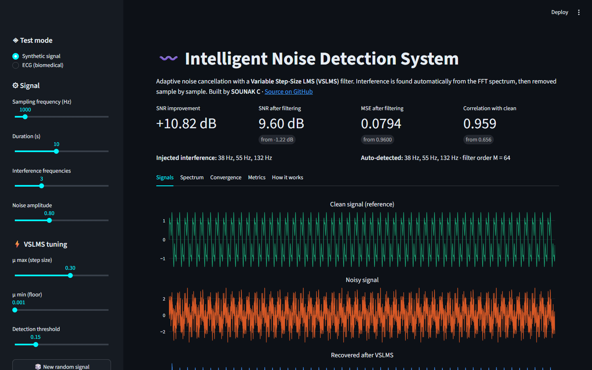
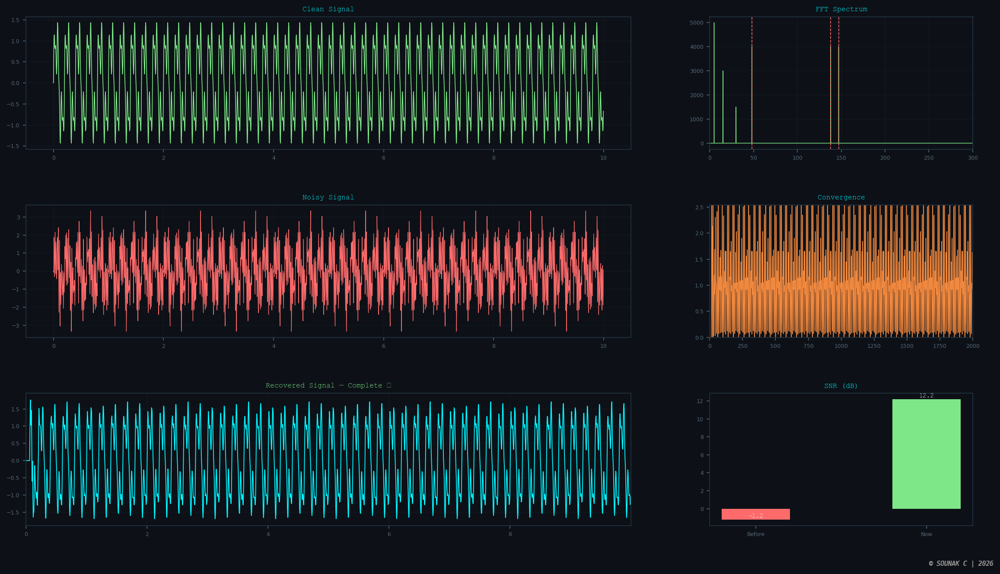

# 🔊 Intelligent Noise Detection System
### Adaptive LMS-Based Noise Cancellation for Biomedical Signals


## 🌐 Live Demo

**Try it in your browser: [sounak-vslms.streamlit.app](https://sounak-vslms.streamlit.app)**. No installation needed.

Choose a synthetic or ECG test signal, adjust the VSLMS parameters, and see the
noisy and recovered signals, FFT spectrum, convergence curves and SNR metrics
update interactively.



---

## 📌 Overview

This project implements an **Intelligent Noise Detection and Cancellation System** using a **Variable Step-Size LMS (VSLMS) adaptive filter** combined with **FFT-based automatic interference detection**.

It is based on the research paper:
> *"Adaptive LMS-Based Noise Cancellation for Biomedical Signals"*

### Rectifications over the base paper:
| Base Paper Limitation | This Project's Improvement |
|---|---|
| Fixed step-size LMS | **Variable step-size NLMS** — μ is driven by the residual interference (Shin–Sayed–Song VSS-NLMS) |
| Assumed/known interference frequency | **Automatic FFT peak detection** — no prior knowledge needed |
| Limited convergence speed | **NLMS-style normalization** — stable and fast at any sampling rate |

---

## 🗂️ Project Structure

```
MINIPROJECT/
│
├── app.py                   # Streamlit web app (live demo)
├── vslms_core.py            # Headless VSLMS pipeline used by the web app
├── Gui.PY                   # Tkinter desktop GUI
├── main.py                  # CLI entry point — Mode 1 (synthetic) or Mode 2 (ECG)
├── signal_generator.py      # Generate synthetic multi-frequency test signals
├── spectral_analysis.py     # FFT and spectrogram computation
├── interference_detector.py # Auto-detect interference via FFT peak detection
├── adaptive_filter.py       # VSLMS adaptive filter (core algorithm)
├── visualization.py         # Signal, FFT, and recovery plots
├── snr.py                   # SNR, MSE, Correlation quality metrics
└── ecg_test.py              # Real-world ECG noise cancellation test
```

---

## ⚙️ How It Works

```
Noisy Signal
     │
     ▼
[FFT Spectral Analysis]
     │
     ▼
[Interference Detection] ← automatic peak detection, no assumed frequency
     │
     ▼
[Reference Signal Generation] ← synthesized from detected frequencies
     │
     ▼
[VSLMS Adaptive Filter] ← variable step-size, NLMS normalized
     │
     ▼
Cleaned Signal
     │
     ▼
[SNR Quality Report + Plots]
```

### Variable Step-Size Update Rule (VSS-NLMS, Shin–Sayed–Song 2004):
```
p(n)   = α·p(n−1) + (1−α) · x(n)·e(n) / ||x(n)||²      ← error–reference correlation
p̂(n)   = p(n) / (1 − αⁿ)                               ← bias correction
μ(n)   = max(μ_min, μ_max · ||p̂(n)||² / (||p̂(n)||² + C))

w(n+1) = w(n) + (μ(n) / ||x(n)||²) × e(n) × x(n)
```
α = 1 − 1/fs (≈ 1 s averaging window), C = 0.01, μ_max = 0.3, μ_min = 0.005.

- Interference not yet cancelled → e(n) correlated with reference → large μ → **fast convergence**
- Interference cancelled → correlation ≈ 0 → μ falls to μ_min → **low misadjustment**
- The wanted signal is *uncorrelated* with the reference, so it does not hold μ up.
  A rule based on error power alone (e.g. μ = μ_max / (1 + β·E[e²])) cannot tell
  them apart, because in noise cancellation the error **is** the cleaned signal.

---

## 🚀 Getting Started

### Prerequisites

```bash
pip install -r requirements.txt
```

### Run the web app locally

```bash
pip install -r requirements.txt
streamlit run app.py
```

### Run the desktop GUI

```bash
python Gui.PY
```



### Run the command-line version

```bash
python main.py
```

You will be prompted to choose a test mode:

```
=== Intelligent Noise Detection System (VSLMS) ===

Select Test Mode:
  1. Synthetic signal test
  2. Real-world ECG test

Enter mode (1 or 2):
```

---

## 🧪 Mode 1 — Synthetic Signal Test

Tests the system on a generated multi-frequency signal with random interference tones.

**Example input:**
```
Enter sampling frequency (Hz): 1000
Enter signal duration (seconds): 10
Enter number of interference frequencies: 3
```

**Output:**
- Clean vs Noisy signal plot
- FFT frequency spectrum
- Recovered signal after VSLMS filtering
- Convergence curve (step-size μ + squared error)
- SNR / MSE / Correlation quality report

---

## 🫀 Mode 2 — Real-World ECG Test

Tests the system on a realistic synthetic ECG signal corrupted with:
- **50 Hz / 60 Hz power-line interference** (+ harmonic)
- **EMG muscle artifact** (broadband noise)
- **Baseline wander** (0.3 Hz breathing drift)

**Example input:**
```
Sampling frequency (Hz): 1000
Duration (seconds): 10
Heart rate BPM: 72
Power-line frequency Hz [50 India / 60 US]: 50
```

**Output:**
- 4-panel ECG plot (clean / noisy / recovered / zoomed heartbeat comparison)
- FFT spectrum before and after (power-line spike removal visible)
- VSLMS convergence curve
- SNR quality report

---

## 📊 Sample Results

SNR improvement (dB), fs = 1000 Hz, 10 s, default settings:

| Test | Fixed μ = 0.3 | Fixed μ = 0.005 | **VSLMS** |
|---|---|---|---|
| Synthetic (3 interference tones) | +10.8 | +12.0 | **+20.7** |
| ECG, power-line interference only | +14.4 | +13.9 | **+27.7** |
| ECG, power-line + EMG + baseline wander | +4.4 | +5.4 | **+5.9** |

VSLMS converges as fast as the large fixed step and reaches the same low
error floor as the small fixed step. In the full ECG test, EMG noise and
baseline wander are broadband / very low frequency and are not in the
reference, so no reference-based canceller removes them. They cap the
achievable SNR.

> Results vary with sampling frequency, signal duration, and number of interference frequencies.

---

## 📦 Module Descriptions

### `signal_generator.py`
Generates a clean multi-frequency base signal (5 Hz + 15 Hz + 30 Hz) and overlays random interference tones in a configurable frequency range.

### `spectral_analysis.py`
Computes FFT magnitude spectrum and spectrogram using `scipy.fft` and `scipy.signal`.

### `interference_detector.py`
Detects interference frequencies automatically by finding peaks in the normalized FFT spectrum. Protects base signal frequencies using a `min_freq` floor.

### `adaptive_filter.py`
Implements the **Variable Step-Size LMS (VSLMS)** adaptive filter:
- Synthesizes a reference signal from detected frequencies
- Adapts step-size per sample from the residual-interference estimate (VSS-NLMS)
- Uses NLMS normalization for stability at high sampling rates
- Auto-scales filter order based on `fs`

### `visualization.py`
Plots clean/noisy signals, FFT spectrum, and 3-panel recovered signal comparison.

### `snr.py`
Computes **SNR (dB)**, **MSE**, and **Pearson Correlation** before and after filtering. Prints a formatted quality report with interpretation and renders a comparison bar chart.

### `ecg_test.py`
Generates a realistic PQRST ECG signal and corrupts it with real-world biomedical noise types. Runs the full VSLMS pipeline and plots ECG-specific comparisons including a zoomed heartbeat panel and frequency spectrum comparison.

---

## 📈 Outputs at a Glance

| Plot | Description |
|---|---|
| Signal Comparison | Clean vs Noisy time-domain |
| FFT Spectrum | Interference spikes in frequency domain |
| Recovered Signal | 3-panel: clean / noisy / filtered |
| Convergence Curve | μ over time + squared error drop |
| SNR Bar Chart | Before vs after on SNR, MSE, Correlation |
| ECG 4-panel | Full ECG + zoomed heartbeat recovery |
| ECG Spectrum | Power-line spike removal visible |

---

## 🧠 Algorithm: VSLMS vs Fixed LMS

```
Fixed LMS:    w(n+1) = w(n) + μ × e(n) × x(n)        ← μ is constant
VSLMS:        w(n+1) = w(n) + μ(n) × e(n) × x(n)     ← μ(n) adapts every sample
```

**Why VSLMS is better:**
- Fixed μ forces a tradeoff: large μ = fast but high steady-state error, small μ = low error but slow
- VSLMS resolves this: μ starts at μ_max (fast convergence) and falls to μ_min once the
  interference is cancelled. The web app's *Convergence* tab plots all three learning curves.

---

## 📚 References

- S. Haykin, *Adaptive Filter Theory*, 5th ed., Pearson, 2014
- B. Widrow & S. D. Stearns, *Adaptive Signal Processing*, Prentice Hall, 1985
- H.-C. Shin, A. H. Sayed & W.-J. Song, "Variable step-size NLMS and affine projection algorithms," *IEEE Signal Processing Letters*, vol. 11, no. 2, pp. 132–135, 2004
- Base Paper: *"Adaptive LMS-Based Noise Cancellation for Biomedical Signals"* (Paper 2)

---

## 👤 Author
**Sounak C**
> Mini Project — Signal Processing  
> Adaptive Noise Cancellation using FFT + VSLMS  
> Python 3.x | VS Code
